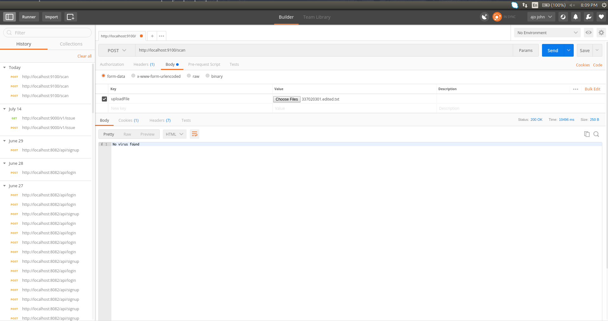
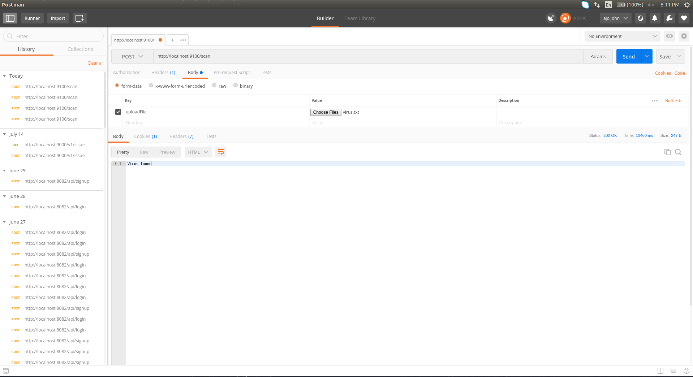

# Nodejs for ClamAV Anti Virus

## Description
A Nodejs API to check if the uploaded submission is infected with a virus or not using ClamAV

## Prerequisites
1. Node >8.x
2. NPM
3. ClamAV installed on a host system

## Run Lint Test
```bash
npm test
```

## Local Deployment
```bash
npm run dev
```

## Production Build and Installation
Run a docker build with the `Dockerfile` and run the image.

## Manual Tests
 - Run the server `npm run dev`
 - Open `uploadTest.html`
 - Upload a File
 - Response will be displayed

## Notes
  - The API expects a file in a `multipart/form-data` POST request with a key `uploadFile`

  

  